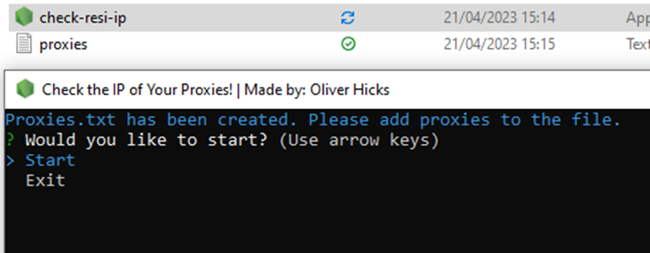
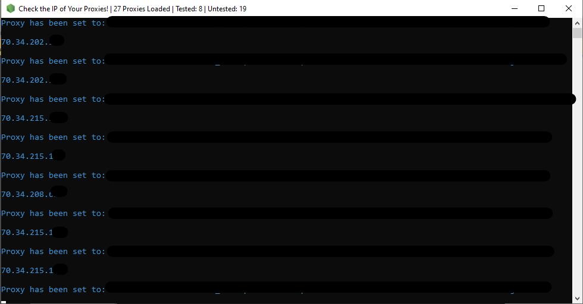

# resi-ip-tester
This is useful if you are worried your residential IPs are not different from proxy to proxy, and to see if your proxies work!

Directions for use:

1. Download .exe file.

2. Put the file in its own folder.

3. Open the exe and it should create you a proxies.txt file, as seen below.

4. Add the proxies you want to test to the txt file, make sure there are no empty lines.

5. Press 'Start' and the cmd window will log the IP addresses of each residential proxy in the list from the first to the last!

All the code behind this can be seen on the git if anyone would like to use it for anything else feel free.

